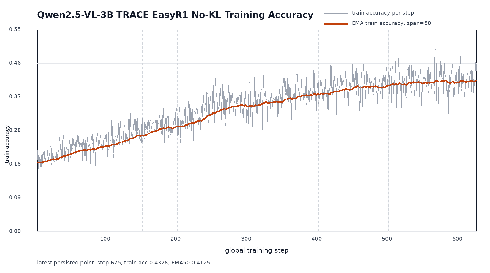

# Qwen2.5-VL-3B TRACE EasyR1 No-KL Train Accuracy

- Source: local W&B `.wandb` histories under `/dev/shm/trace_rlvr/wandb/wandb`.
- Metric: `reward/accuracy` from train batches.
- De-duplication: runs are applied chronologically; later resumed runs overwrite duplicate global steps.
- EMA: span 50 steps, alpha 0.039216.
- Raw train metric records: 677; duplicate overwritten records: 52; merged steps: 625.
- Step range: 1 to 625; missing steps in range: 0.
- Latest point: step 625, train accuracy 0.432617, EMA50 0.412458.
- Mean train accuracy over latest 25 merged steps: 0.414062.
- Mean train accuracy over latest 50 merged steps: 0.409453.

## Included Runs

| Order | Run ID | Max Steps | Experiment |
|---:|---|---:|---|
| 0 | `71x4fc3d` | 200 | `trace_qwen25vl3b_easyr1_answer_nokl_noref_step200_bsz128_rollout8_val500_20260710T073846Z` |
| 1 | `ia3kdd6n` | 400 | `trace_qwen25vl3b_easyr1_answer_nokl_noref_resume150_to400_bsz128_rollout8_val500_20260710T141409Z` |
| 2 | `tsz4p6iu` | 400 | `trace_qwen25vl3b_easyr1_answer_nokl_noref_resume300_to400_bsz128_rollout8_val500_20260710T190612Z` |
| 3 | `eqq46wiq` | 500 | `trace_qwen25vl3b_easyr1_answer_nokl_noref_resume400_to500_bsz128_rollout8_val500_20260710T221119Z` |
| 4 | `befgwmx7` | 600 | `trace_qwen25vl3b_easyr1_answer_nokl_noref_resume500_to600_bsz128_rollout8_val500_20260711T042102Z` |
| 5 | `u98u42ja` | 700 | `trace_qwen25vl3b_easyr1_answer_nokl_resume600_to700_bsz128_rollout8_val500_20260711T102124Z` |

## Artifacts

- CSV: `results/qwen25vl3b_easyr1_answer_nokl_train_accuracy_by_step.csv`
- Plot: `results/qwen25vl3b_easyr1_answer_nokl_train_accuracy_curve.png`
